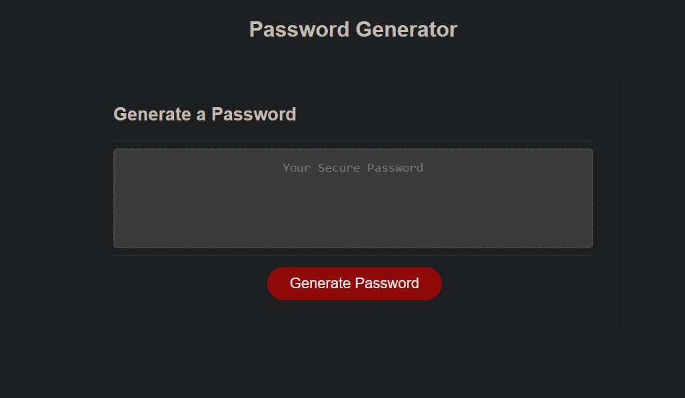

# Password-Generator

## Table of Contents 

- [Description](#description)
- [Images](#description)
- [Link](#link)
- [Creator](#creator)

## Description

This project was created to practice basic javascript functions to create an application that allows a user to generate a random password by answering a few short questions to help determine what to include in the users generated password.

## Images

## Link 

https://northgoddard.github.io/Password-Generator/

## Creator

- North Goddard (https://github.com/northgoddard)